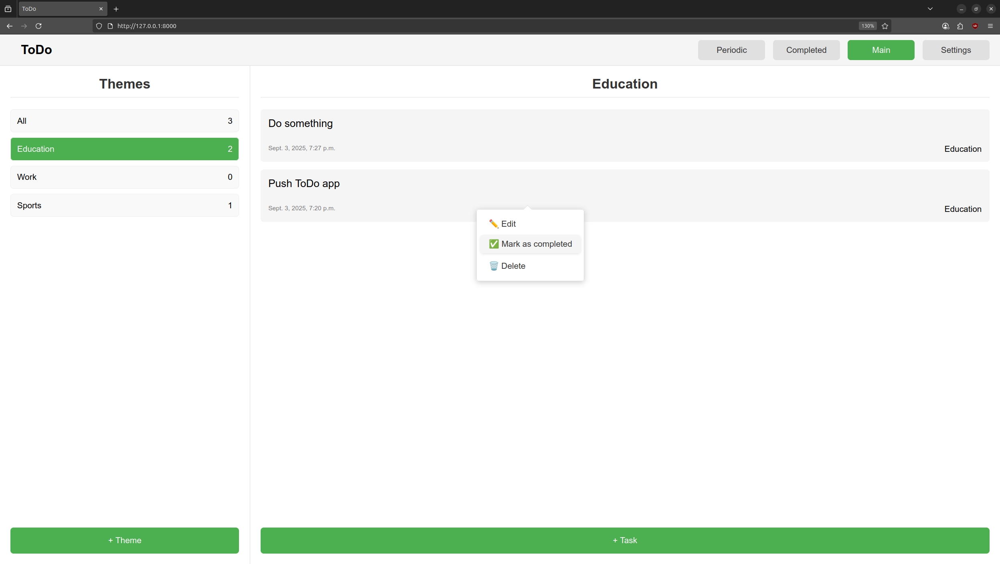

# 📝 Django ToDo App

Простое и удобное веб-приложение для управления задачами, построенное на Django.



## 📋 Оглавление

- [О проекте](#о-проекте)
- [Функциональность](#функциональность)
- [Установка и запуск](#установка-и-запуск)
- [Использование](#использование)
- [Структура проекта](#структура-проекта)
- [API endpoints](#api-endpoints)
- [Технологии](#технологии)

## 🎯 О проекте

Django ToDo App - это простое веб-приложение для управления повседневными задачами. Позволяет создавать, редактировать, удалять и отмечать задачи как выполненные. Задачи можно организовывать по темам для лучшей категоризации.

## ✨ Функциональность

- ✅ **Создание и управление задачами**
- 🏷️ **Система тем/категорий**
- ✔️ **Отметка выполнения задач**
- 🔍 **Фильтрация задач (активные/завершенные)**
- ⏰ **Автоматическое сохранение времени создания и завершения**

## 🛠️ Установка и запуск

### Предварительные требования
- Python 3.8 или выше
- pip (менеджер пакетов Python)

### Шаг 1: Клонирование репозитория
```bash
git clone https://github.com/Qwertyil/ToDo
cd Todo
```

### Шаг 2: Создание виртуального окружения
```bash
python -m venv venv
source venv/bin/activate  # Linux/Mac
# или
venv\Scripts\activate     # Windows
```

### Шаг 3: Установка зависимостей
```bash
pip install -r requirements.txt
```

### Шаг 4: Настройка базы данных
```bash
python manage.py migrate
```

### Шаг 5: Создание суперпользователя (опционально)
```bash
python manage.py createsuperuser
```

### Шаг 6: Запуск сервера
```bash
python manage.py runserver
```

Приложение будет доступно по адресу: http://localhost:8000

Админ-панель: http://localhost:8000/admin (если создавали суперпользователя)

## 🚀 Использование

### Основные операции
1. **Добавление задачи** - нажмите "+ Task" на главной странице
2. **Редактирование** - кликните на задачу в списке
3. **Отметка выполнения** - ПКМ на задаче -> "Mark as completed"
4. **Удаление** - ПКМ на задаче -> "Delete"
5. **Фильтрация** - используйте навигационный бар наверху страницы "Main", "Completed"
6. **Добавление темы** - нажмите "+ Theme" на главной странице
7. **Удаление темы** - ПКМ на теме -> "Delete"

## 📁 Структура проекта

```
.
├── db.sqlite3
├── manage.py
├── README.md
├── requirements.txt
├── tasks
│   ├── admin.py
│   ├── apps.py
│   ├── forms.py
│   ├── __init__.py
│   ├── migrations
│   │   ├── 0001_initial.py
│   │   ├── 0002_alter_theme_name.py
│   │   ├── __init__.py
│   ├── models.py
│   ├── static
│   │   └── tasks
│   │       ├── mark_current_page_name.js
│   │       ├── mark_current_theme.js
│   │       ├── style.css
│   │       └── task_context_menu.js
│   ├── templates
│   │   ├── layout
│   │   │   ├── basic.html
│   │   │   ├── confirm_delete.html
│   │   │   └── form.html
│   │   └── tasks
│   │       ├── coming_soon.html
│   │       ├── index.html
│   │       ├── tasks_completed.html
│   │       ├── tasks_completed_info.html
│   │       ├── tasks_confirm_delete.html
│   │       ├── tasks_edit.html
│   │       ├── tasks_new.html
│   │       ├── themes_confirm_delete.html
│   │       └── themes_new.html
│   ├── tests.py
│   ├── urls.py
│   └── views.py
└── ToDo
    ├── asgi.py
    ├── __init__.py
    ├── settings.py
    ├── urls.py
    └── wsgi.py
```

## 🌐 API Endpoints

| Метод | Endpoint        | Описание                             |
|-------|-----------------|--------------------------------------|
| GET | `/`             | Главная страница со списком задач    |
| GET | `/new/`         | Форма создания задачи                |
| GET | `/<id>/`        | Форма редактирования задачи          |
| GET | `/delete/<id>/` | Удаление задачи (окно подтверждения) |
| GET | `/themes/new/`  | Новая тема                           |
| GET | `/themes/delete/<id>/` | Удаление темы (окно подтверждения) |

## 🛠️ Технологии

- **Backend:** Django
- **Database:** SQLite3
- **Frontend:** HTML, CSS, JavaScript
- **Templates:** Django Template Language


## 📞 Поддержка

Если у вас возникли вопросы или предложения:
- tg: @Amir04001

---

**Примечание:** Это учебный проект, предназначенный для демонстрации возможностей Django. Для production использования рекомендуется использовать PostgreSQL вместо SQLite и добавить дополнительные функции безопасности.
